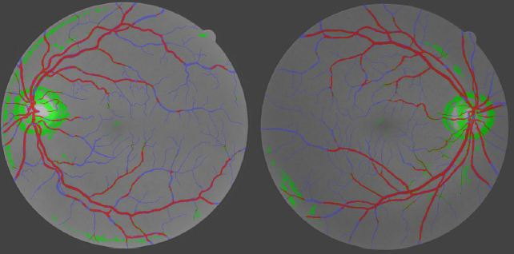
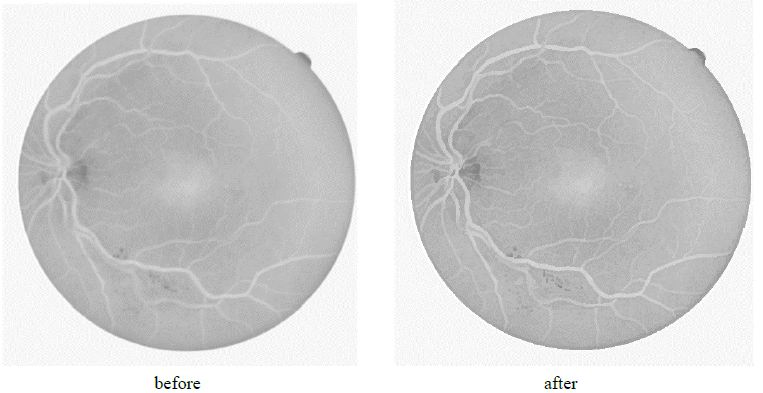
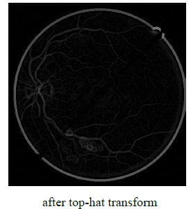

# Retinal Vessel Segmentaion in Fundus Images
This project is a simple implementation of morphological operation based retinal vessel segmentation.

**Sample Result:** Red - true positive, Green - false positive, Blue - false negative

-----
### Step 1: Preprocessing

This step contains green channel extraction (because retinal image has highest contrast in green channel) and gaussian filtering (for denoising).

### Step 2: Toggle mapping filtering

[This step](toggle.c) is for vessel enhancement which is based on the comparison between the input image and its [opening](opening.c) and [closing](closing.c)

### Step 3: Top-hat transformation

- top-hat: the difference between the original image and its opening														

The top-hat transform is applied so that background areas are set to zero and vessels are enhanced. The sum of several top-hat transforms is later `AND` with the eroded mask to get rid of the bright boundary.

In this code, the [top-hat](tophat.c) is implemented by min-max filter, i.e. erosion is min filter, dilation is max filter			

### Step 4: Classification

A linear normalization is then performed to reduce the effect of variance of image intensities by using the formula described in [Wikipedia](https://en.wikipedia.org/wiki/Normalization_(image_processing)) as:

\frac{newMax-newMin}{Max-Min}&plus;newMin)

After trying several threshold values (50, 60, 70, etc), 60 is set to get comparatively optimal segmentation performance.

### Platform

This project is developed under [VisionX](http://www.via.cornell.edu/visionx/vxmore.html), which is an open source library for image processing program development, using C and shell script.

### Reference Papers
[1] Rossant, Florence, et al. "A morphological approach for vessel segmentation in eye fundus images, with quantitative evaluation." Journal of Medical Imaging and Health Informatics 1.1 (2011): 42-49.

[2] Walter T, Klein JC. Segmentation of color fundus images of the human retina: Detection of the optic disc and the vascular tree using morphological techniques”. International Symposium on Medical Data Analysis 2001 Oct 8 (pp. 282-287).

[3] Zana F, Klein JC. “Segmentation of vessel-like patterns using mathematical morphology and curvature evaluation”. IEEE Trans. Image Processing. 2001 Jul;10(7):1010-9.
